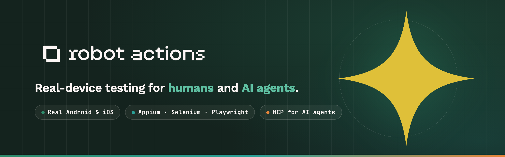

<p align="center">
  <a href="https://robotactions.com">
    
  </a>
</p>

<p align="center">
  <strong>Test mobile and web apps from anywhere.</strong>
</p>

<p align="center">
  <a href="https://robotactions.com/#services">Services</a> ·
  <a href="https://robotactions.com/#pricing">Pricing</a> ·
  <a href="USING_MCP.md">Use from an AI agent</a> ·
  <a href="skills/">Agent Skills</a> ·
  <a href="https://github.com/krishtoautomate/robotactions/issues">File an issue</a>
</p>

---

Robot Actions is a cloud-connected testing platform that lets you control real Android and iOS devices through a web browser, automate test flows with an AI assistant, and generate runnable test scripts in your framework of choice (WebdriverIO, Python, Robot Framework, and more).

For sales or enterprise questions: support@robotactions.com.

<!-- mcp-name: io.github.krishtoautomate/remote-device-server -->

---

## See it in action

Real iOS and Android devices, streamed live to your browser — no emulators, no local setup. A few of the things you can do:

### AI Agent — explore an app and find bugs

Chat with the built-in AI Agent right inside a device session — ask it to find a defect or suggest improvements, and it drives the device on its own: screenshots, reads the screen, taps and swipes, and reports back findings and recommendations.

<video src="https://github.com/user-attachments/assets/83326ac2-2c53-4b47-b7e7-625641064bc0" controls width="640">
  <a href="https://github.com/user-attachments/assets/83326ac2-2c53-4b47-b7e7-625641064bc0">▶ Watch the demo</a>
</video>

### Real-device control — play, draw, anything

Native-speed touch on a real iPad: playing a game and sketching in Freeform, straight from the browser.

<video src="https://github.com/user-attachments/assets/263e71d6-c03b-4753-975e-2c1fa413b64c" controls width="280">
  <a href="https://github.com/user-attachments/assets/263e71d6-c03b-4753-975e-2c1fa413b64c">▶ Watch the demo</a>
</video>

### Real-time mouse & keyboard control

Native-speed pointer and keyboard input on both iOS and Android — type and click straight from your machine with no lag.

<video src="https://github.com/user-attachments/assets/70ce3e9a-2846-47c5-af42-9c0763ce8419" controls width="640">
  <a href="https://github.com/user-attachments/assets/70ce3e9a-2846-47c5-af42-9c0763ce8419">▶ Watch the demo</a>
</video>

### Web Inspector for mobile Safari

Full DevTools — Network, Elements, Console, Application — attached to Safari running on a real iOS device.

<video src="https://github.com/user-attachments/assets/dd40cff5-ea4f-4f7f-8495-18027368c54d" controls width="640">
  <a href="https://github.com/user-attachments/assets/dd40cff5-ea4f-4f7f-8495-18027368c54d">▶ Watch the demo</a>
</video>

### Chrome DevTools on Android (CDP)

Full Chrome DevTools over the DevTools Protocol — Elements, Console, Network, Application — inspecting a live page on a real Android device.

<video src="https://github.com/user-attachments/assets/da84182d-70e1-4e77-aa57-5d8a095c133e" controls width="640">
  <a href="https://github.com/user-attachments/assets/da84182d-70e1-4e77-aa57-5d8a095c133e">▶ Watch the demo</a>
</video>

### Capture & mock network traffic

Watch live HTTP(S) flows from the device, then add rules to mock, abort, or rewrite matching requests — set the status, headers, and response body on the fly.

<video src="https://github.com/user-attachments/assets/d3e8b177-2983-4940-9bd5-52d945c55bf4" controls width="640">
  <a href="https://github.com/user-attachments/assets/d3e8b177-2983-4940-9bd5-52d945c55bf4">▶ Watch the demo</a>
</video>

### Mock GPS location

Drop a pin anywhere — search a city or set latitude/longitude — and the device reports that location to any app, so you can test geo-aware flows without leaving your desk.

<video src="https://github.com/user-attachments/assets/d93d160f-6a8e-4210-9d92-f92aa30b1cbb" controls width="640">
  <a href="https://github.com/user-attachments/assets/d93d160f-6a8e-4210-9d92-f92aa30b1cbb">▶ Watch the demo</a>
</video>

### Light & dark themes

The web console follows your preference — switch between light and dark on the fly.

<video src="https://github.com/user-attachments/assets/b5ebee16-9c1a-49db-9487-afc3603c8a83" controls width="640">
  <a href="https://github.com/user-attachments/assets/b5ebee16-9c1a-49db-9487-afc3603c8a83">▶ Watch the demo</a>
</video>

> More feature walkthroughs are on the way.

---

## Robot Actions on the MCP Registry

The hosted MCP server is published at <https://registry.modelcontextprotocol.io> as `io.github.krishtoautomate/remote-device-server` and auto-syncs to:

- **GitHub MCP Registry** (`github.com/mcp`) — shows up in VS Code under `@mcp`
- **Smithery** (`smithery.ai`) — install via the toolbox button
- **glama.ai/mcp** — community aggregator

Manifest source: [`server.json`](server.json) in this repo mirrors the published version.

---

## Agent Skills

Connecting an agent to the MCP server gives it several hundred tools. It does not tell it
how to use them — and left to itself an agent will tap coordinates read off a downscaled
screenshot, type before the field has focus, and report success from a screen it never
checked.

[`skills/`](skills/) holds open-source **Agent Skills** that supply that missing
procedural knowledge: which tool, in what order, and the mistakes that quietly turn a
passing test into one that tested nothing.

Install all four into any agent — Claude Code, Cursor, GitHub Copilot, Gemini CLI, Amp and
a dozen more read the same universal format:

```bash
npx skills add krishtoautomate/robotactions
```

Claude Code users can install it as a plugin instead, which also registers the MCP server:

```
/plugin marketplace add krishtoautomate/robotactions
/plugin install robotactions@robotactions
```

| Skill | Covers |
|---|---|
| [robotactions-getting-started](skills/robotactions-getting-started/SKILL.md) | Connect, authenticate, verify, device holds and the parallel limit |
| [mobile-app-testing](skills/mobile-app-testing/SKILL.md) | Driving native Android and iOS apps on real hardware |
| [web-app-testing](skills/web-app-testing/SKILL.md) | The web on a real device browser or the desktop grid |
| [device-state-setup](skills/device-state-setup/SKILL.md) | Files for upload flows, GPS, locale, dark mode, clean app state |
| [network-mocking](skills/network-mocking/SKILL.md) | Mocking and capturing traffic — native app requests as well as web |
| [framework-integration](skills/framework-integration/SKILL.md) | Using the tools with an existing Appium/Selenium/Playwright suite |
| [flow-record-replay](skills/flow-record-replay/SKILL.md) | Recording replayable regression tests with assertions |

Not a Claude Code user? Each skill is a plain folder with a `SKILL.md` — copy what you
want. [`skills.json`](skills.json) is a machine-readable index.
Browse them at [robotactions.com/skills](https://robotactions.com/skills).

---

## What this repo is for

This repo contains **no application source code** — Robot Actions is a hosted product, there is nothing to install or build. The repo exists for four current purposes plus one that's coming:

1. **Public issue intake.** File a bug, request a feature, or ask a question via the [Issues tab](../../issues). No paid account required — drive-by feedback is welcome.
2. **Release notes.** Every shipped change is published as a [Release](../../releases) with user-facing notes. That's the running changelog.
3. **Agent Skills.** [`skills/`](skills/) — open-source guidance that teaches an AI agent how to actually use the MCP server well. Also installable as a Claude Code plugin marketplace from this repo root.
4. **Test framework examples (coming soon).** Once the product is more widely used, this repo will host runnable example scripts in the test frameworks Robot Actions can generate — WebdriverIO, Python (`appium-python-client` style), Robot Framework, and more. These will live as small standalone projects under `examples/` so you can copy-paste a starting point. **None of the application source will ever land here** — the examples are public starter templates, not the product.
5. **Public roadmap & discussions** — being scoped.

## When to file an Issue here vs. when to email us

| Filing here | Email us at support@robotactions.com |
|---|---|
| Bug reproductions, feature requests, public questions | Account-specific issues (billing, credentials, dedicated deployments) |
| "Does Robot Actions support X?" | Anything that would expose your account email, device IDs, or session data publicly |
| General feedback / ideas | Sales conversations, enterprise contracts |

## Security disclosures

**Do not file security issues here.** See [SECURITY.md](SECURITY.md) for the responsible-disclosure process.

## Releases

Every shipped change is published as a Release with user-facing notes. [Browse releases →](../../releases)

---

## License

This README, the issue templates, the [`skills/`](skills/) Agent Skills, and any future `examples/` test scripts are MIT-licensed. The Robot Actions product itself is a hosted commercial service — not open source, and no application source code lives in this repo.
